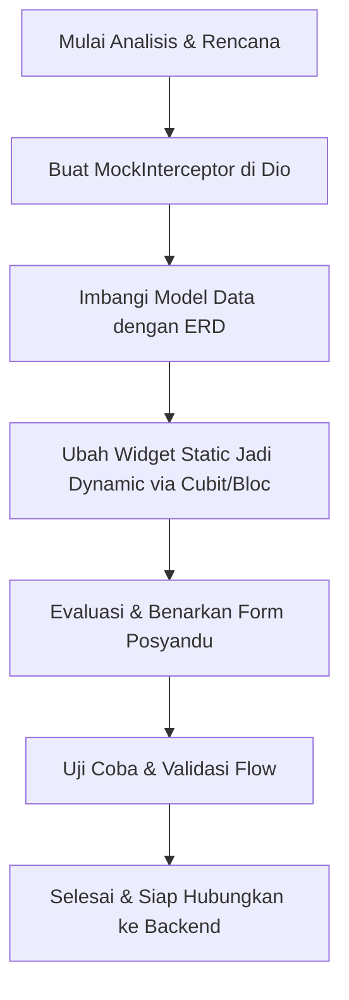

# NalarGizi Frontend Integration Blueprint (Mock API & ERD Mapping)

Dokumen ini berisi analisis detail dari folder `lib`, spesifikasi dummy data JSON untuk semua fitur, pemetaan tabel berdasarkan ERD, serta rencana implementasi Mock API menggunakan Dio Interceptor. Ini dirancang untuk memudahkan transisi ketika nantinya dihubungkan ke backend riil.

---

## 1. Analisis Struktur Kode Saat Ini (`lib/`)

Struktur direktori saat ini mengikuti pendekatan **Clean Architecture** berbasis modul fitur:

- **`lib/app/`**: Konfigurasi global aplikasi.
  - `app.dart`: Entry point MaterialApp, konfigurasi rute (`routes`).
  - `layout/main_layout.dart`: Layout utama dengan `CustomBottomNavigationBar` interaktif.
  - `router/app_router.dart`: Definisi konstanta nama rute.
  - `theme/`: Konfigurasi warna, font, dan gaya visual UI.
- **`lib/core/`**: Fungsionalitas bersama yang tidak terikat fitur spesifik.
  - `network/api_client.dart`: Konfigurasi `Dio` client.
  - `network/api_endpoints.dart`: Konstanta endpoint backend.
- **`lib/features/`**: Modul fungsional (Presentation, Domain, Data).
  - `auth`: Halaman Login (`login_page.dart` - saat ini berupa skeleton).
  - `dashboard`: Halaman utama (`dashboard_page.dart`) dan widget-widget pendukungnya.
  - `growth`: Manajemen tumbuh kembang anak (Kurva BB/TB, riwayat, dan form input).
  - `nutrition`: Pencatatan kalori harian (sarapan, makan siang, makan malam, hidrasi).
  - `posyandu`: Jadwal posyandu, imunisasi, dan riwayat selesai.
  - `quick_add`: Bottom sheet pop-up untuk pencatatan cepat.
  - `profile`: Halaman profil orang tua dan anak, serta notifikasi.

---

## 2. Strategi Mocking via Dio Interceptor

Agar semua UI langsung dinamis dan terhubung dengan Dio, kita tidak akan menyimpan data static di dalam widget. Kita akan menggunakan **Dio Mock Interceptor** (`MockInterceptor`).

### Alur Kerja:
1. Saat aplikasi dalam mode debug (`kDebugMode`), `MockInterceptor` ditambahkan ke `ApiClient`.
2. Interceptor mencegat (`onRequest`) request HTTP yang mengarah ke endpoint tertentu.
3. Interceptor mensimulasikan delay jaringan (misal: 500ms) lalu mengembalikan object `Response` berisi dummy data JSON yang strukturnya sesuai dengan skema database ERD.
4. Ketika backend asli sudah siap, kita hanya perlu menonaktifkan `MockInterceptor` ini pada `ApiClient`.

```dart
// Lokasi: lib/core/network/mock_interceptor.dart
import 'package:dio/dio.dart';

class MockInterceptor extends Interceptor {
  @override
  void onRequest(RequestOptions options, RequestInterceptorHandler handler) async {
    // Simulasi delay jaringan
    await Future.delayed(const Duration(milliseconds: 500));

    final path = options.path;
    
    if (path.contains('/api/auth/login')) {
      return handler.resolve(Response(
        requestOptions: options,
        data: _authLoginMock,
        statusCode: 200,
      ));
    }
    // Endpoint lainnya...
    
    super.onRequest(options, handler);
  }
}
```

---

## 3. Pemetaan Fitur & Skema JSON Dummy (Berdasarkan ERD)

### A. Fitur Auth (`/api/auth/*`)
- **Tabel ERD**: `USERS`, `CHILDREN`
- **Skenario**: Login, Register, Forgot Password, OAuth2 (Google Login).
- **Endpoint**:
  - `POST /api/auth/login`
  - `POST /api/auth/register`
  - `POST /api/auth/forgot-password`
  - `POST /api/auth/google`

#### JSON Mock: Auth Success (Login / Register / Google Auth)
```json
{
  "token": "dummy_jwt_token_eyJhbGciOiJIUzI1NiIsInR5cCI6IkpXVCJ9",
  "user": {
    "id": 1,
    "name": "Zidnie",
    "email": "zidni@gmail.com",
    "phone_number": "081234567890",
    "email_verified_at": "2026-05-27T06:00:00.000Z",
    "created_at": "2026-05-27T06:00:00.000Z",
    "updated_at": "2026-05-27T06:00:00.000Z"
  },
  "child": {
    "id": 1,
    "user_id": 1,
    "name": "Arkan NalarGizi",
    "birth_date": "2025-03-15",
    "gender": "Laki-laki",
    "created_at": "2026-05-27T06:00:00.000Z",
    "updated_at": "2026-05-27T06:00:00.000Z"
  }
}
```

---

### B. Fitur Dashboard (`/api/dashboard/*`)
- **Tabel ERD**: `CHILDREN`, `GROWTH_RECORDS`, `EDUCATIONAL_CONTENTS`, `SCHEDULES`, `POSYANDU_CENTERS`
- **Skenario**:
  - Tampilan header nama bayi, usia (bulan), berat terakhir, dan status Z-Score.
  - Tips Harian dinamis berdasarkan status Z-Score.
  - Jadwal terdekat (jika diklik "Lihat Semua", akan menampilkan semua jadwal).
  - Edukasi Gizi berupa daftar video YouTube dengan gambar thumbnail otomatis dari format YouTube `https://img.youtube.com/vi/<video_id>/hqdefault.jpg`.
  - Informasi detail Posyandu aktif.
- **Endpoint**:
  - `GET /api/dashboard/overview?child_id=1`

#### JSON Mock: Dashboard Overview
```json
{
  "child_info": {
    "name": "Arkan NalarGizi",
    "age_months": 14,
    "gender": "Laki-laki"
  },
  "last_growth": {
    "weight_kg": 9.8,
    "height_cm": 76.5,
    "z_score_status": "Normal",
    "recorded_at": "2026-05-20"
  },
  "daily_tip": {
    "title": "Tips Gizi Normal (Z-Score)",
    "content": "Status gizi Arkan terpantau normal. Lanjutkan pemberian ASI/MPASI dengan porsi seimbang dan perbanyak protein hewani seperti hati ayam dan telur untuk menunjang tumbuh kembang kognitif."
  },
  "nearest_schedule": {
    "id": 101,
    "posyandu_center_name": "Posyandu Mawar 1",
    "title": "Imunisasi Campak & Timbang Rutin",
    "description": "Pemeriksaan berkala pertumbuhan bayi serta pemberian imunisasi wajib.",
    "event_date": "2026-06-05T08:00:00.000Z"
  },
  "posyandu_center": {
    "id": 5,
    "name": "Posyandu Mawar 1",
    "address": "Jl. Mawar Merah No. 45, RT 02/RW 03, Jakarta Selatan",
    "leader_name": "Bidan Siti Aminah"
  },
  "educational_contents": [
    {
      "id": 1,
      "title": "Pentingnya Protein Hewani untuk Mencegah Stunting",
      "media_url": "https://www.youtube.com/watch?v=dQw4w9WgXcQ",
      "thumbnail_url": "https://img.youtube.com/vi/dQw4w9WgXcQ/hqdefault.jpg",
      "duration": "08:45"
    },
    {
      "id": 2,
      "title": "Panduan MPASI Praktis untuk Bayi Usia 12-24 Bulan",
      "media_url": "https://www.youtube.com/watch?v=dQw4w9WgXcQ",
      "thumbnail_url": "https://img.youtube.com/vi/dQw4w9WgXcQ/hqdefault.jpg",
      "duration": "12:30"
    }
  ]
}
```

---

### C. Fitur Growth / Tumbuh Kembang (`/api/growth/*`)
- **Tabel ERD**: `GROWTH_RECORDS`
- **Skenario**:
  - Menu Berat Badan: Pengukuran terakhir, kenaikan bulan ini (Kenaikan = `Pengukuran Sebelumnya` - `Pengukuran Sekarang` sesuai instruksi, meskipun secara matematis pertumbuhan normal adalah `Pengukuran Sekarang` - `Pengukuran Sebelumnya`. Kita akan menyediakan variabel perbandingan yang jelas).
  - Grafik pertumbuhan berat badan per bulan.
  - Menu Tinggi Badan: Logika yang sama dengan berat badan (pengukuran terakhir, perubahan tinggi, grafik tinggi badan).
  - Riwayat lengkap dan form penginputan data pengukuran baru.
- **Endpoint**:
  - `GET /api/growth/records?child_id=1`
  - `POST /api/growth/records` (Form input baru)

#### JSON Mock: Growth Records List
```json
[
  {
    "id": 12,
    "child_id": 1,
    "age_months": 14,
    "weight_kg": 9.8,
    "height_cm": 76.5,
    "head_circumference_cm": 46.0,
    "z_score_status": "Normal",
    "recorded_at": "2026-05-20"
  },
  {
    "id": 11,
    "child_id": 1,
    "age_months": 13,
    "weight_kg": 9.4,
    "height_cm": 75.0,
    "head_circumference_cm": 45.5,
    "z_score_status": "Normal",
    "recorded_at": "2026-04-18"
  },
  {
    "id": 10,
    "child_id": 1,
    "age_months": 12,
    "weight_kg": 9.1,
    "height_cm": 73.8,
    "head_circumference_cm": 45.0,
    "z_score_status": "Normal",
    "recorded_at": "2026-03-15"
  }
]
```

- **Perhitungan Kenaikan**:
  - Berat Badan: Pengukuran Sebelumnya (9.4 kg) - Pengukuran Sekarang (9.8 kg) = -0.4 kg. (Jika ingin nilai kenaikan positif, rumusnya dibalik menjadi `Sekarang - Sebelumnya` = +0.4 kg. Kita akan menerapkan perhitungan ini secara fleksibel di repository).

---

### D. Fitur Nutrition (`/api/nutrition/*`)
- **Tabel ERD**: `NUTRITION_LOGS`
- **Skenario**:
  - Target kalori harian, total kalori terkonsumsi, sisa target kalori (dilengkapi grafik linear progres dari kiri ke kanan).
  - Ringkasan makanan harian berdasarkan waktu makan: Sarapan (07:00), Makan Siang (12:30), Makan Malam (18:00).
  - Status makanan: "Habis", "Sisa Sedikit", "Tidak Habis" (atau "Tambah Makanan" jika data kosong).
  - Status hidrasi harian (gelas air putih) dihitung secara dinamis.
- **Endpoint**:
  - `GET /api/nutrition/daily?child_id=1&date=2026-05-27`
  - `POST /api/nutrition/logs` (Tambah makanan baru)

#### JSON Mock: Nutrition Daily Summary
```json
{
  "target_calories": 1100,
  "consumed_calories": 330,
  "remaining_calories": 770,
  "hydration_glasses_target": 6,
  "hydration_glasses_done": 4,
  "meals": [
    {
      "id": 201,
      "meal_time": "breakfast",
      "time_label": "07:00",
      "food_name": "Bubur Hati Ayam + Bayam",
      "portion": "1 Porsi",
      "calories": 150,
      "status": "Habis"
    },
    {
      "id": 202,
      "meal_time": "lunch",
      "time_label": "12:30",
      "food_name": "Nasi Tim Telur Puyuh",
      "portion": "1 Porsi",
      "calories": 180,
      "status": "Sisa Sedikit"
    },
    {
      "id": 203,
      "meal_time": "dinner",
      "time_label": "18:00",
      "food_name": null,
      "portion": null,
      "calories": 0,
      "status": "Belum Mencatat"
    }
  ]
}
```

---

### E. Fitur Posyandu (`/api/posyandu/*`)
- **Tabel ERD**: `SCHEDULES`, `POSYANDU_CENTERS` (Virtual: Imunisasi)
- **Skenario**:
  - Evaluasi & perbaikan sistem input Posyandu saat ini agar sesuai dengan standard data source Dio.
  - Daftar jadwal "Akan Datang", "Selesai" (Riwayat), dan checklist "Imunisasi".
  - Untuk imunisasi: Mencocokkan status imunisasi anak dengan **7 Imunisasi Dasar Wajib** (BCG, Polio 1, DPT 1, DPT 2, DPT 3, Campak, MR). Jika anak sudah pernah mendapatkannya, tandai warna **Hijau (✓)**.
- **Endpoint**:
  - `GET /api/posyandu/overview?child_id=1`
  - `POST /api/posyandu/schedule` (Tambah rencana kunjungan baru)

#### JSON Mock: Posyandu Overview
```json
{
  "immunizations": [
    { "name": "BCG", "is_done": true, "date_given": "2025-04-15" },
    { "name": "Polio 1", "is_done": true, "date_given": "2025-04-15" },
    { "name": "DPT 1", "is_done": true, "date_given": "2025-06-10" },
    { "name": "DPT 2", "is_done": true, "date_given": "2025-07-15" },
    { "name": "DPT 3", "is_done": false, "date_given": null },
    { "name": "Campak", "is_done": false, "date_given": null },
    { "name": "MR", "is_done": false, "date_given": null }
  ],
  "upcoming_schedules": [
    {
      "id": 301,
      "title": "Posyandu Bulanan & Vitamin A",
      "category": "Vitamin",
      "location": "Puskesmas Garuda",
      "scheduled_at": "2026-06-05T08:00:00.000Z",
      "note": "Bawa Buku KIA dan kartu imunisasi",
      "is_completed": false
    }
  ],
  "completed_schedules": [
    {
      "id": 300,
      "title": "Imunisasi DPT 2",
      "category": "Imunisasi",
      "location": "Puskesmas Garuda",
      "scheduled_at": "2025-07-15T08:00:00.000Z",
      "note": "Kondisi anak sehat, tidak ada demam setelahnya",
      "is_completed": true
    }
  ]
}
```

---

### F. Fitur Quick Add (`/api/quickadd/*`)
- **Tabel ERD**: `GROWTH_RECORDS`, `NUTRITION_LOGS`, `SCHEDULES`
- **Skenario**:
  - Tombol aksi cepat di bagian tengah navigation bar untuk:
    1. Menambah data Berat & Tinggi Badan.
    2. Menambah Jurnal Nutrisi Harian (Sarapan / Makan Siang / Makan Malam).
    3. Menjadwalkan kunjungan Posyandu berikutnya / mencatat Imunisasi.
- **Endpoint**:
  - Dialihkan langsung ke API endpoint fitur yang bersangkutan (`POST /api/growth/records`, `POST /api/nutrition/logs`, atau `POST /api/posyandu/schedule`).

---

### G. Fitur Profile & Notifikasi (`/api/profile/*`)
- **Tabel ERD**: `USERS`, `CHILDREN` (Virtual: Notifikasi)
- **Skenario**:
  - Profil Pengguna (Parent) dan Profil Bayi.
  - Fitur Notifikasi (belum ada di ERD asli): Berisi informasi pengingat jadwal timbang, imunisasi, maupun artikel.
  - Halaman riwayat lengkap semua rekaman histori anak.
- **Endpoint**:
  - `GET /api/profile/info`
  - `GET /api/profile/notifications`
  - `GET /api/profile/history`

#### JSON Mock: Notifications List
```json
[
  {
    "id": 1,
    "title": "Jadwal Posyandu Terdekat",
    "message": "Jangan lupa datang ke Posyandu Mawar 1 besok pukul 08:00 untuk Imunisasi Campak Arkan.",
    "type": "posyandu",
    "is_read": false,
    "created_at": "2026-05-26T18:00:00.000Z"
  },
  {
    "id": 2,
    "title": "Tips Z-Score Arkan",
    "message": "Berdasarkan timbangan terakhir, grafik tumbuh kembang Arkan membaik. Lihat tips gizi di sini.",
    "type": "growth",
    "is_read": true,
    "created_at": "2026-05-20T10:00:00.000Z"
  }
]
```

---

## 4. Langkah dan Peta Implementasi Selanjutnya

Berikut adalah tahapan implementasi yang diusulkan untuk melengkapi data dinamis di seluruh folder `lib`:



1. **Setup Core Network**:
   - Daftarkan `MockInterceptor` di `ApiClient`.
   - Tambahkan daftar endpoint lengkap di `ApiEndpoints`.
2. **Implementasi Autentikasi**:
   - Buat halaman register, reset password, dan integrasikan tombol Google Sign-In.
   - Sambungkan auth cubit dengan interceptor.
3. **Penyambungan Data Dashboard & Growth**:
   - Buat model data: `ChildModel`, `GrowthRecordModel`, `TipModel`, `EducationalContentModel`.
   - Integrasikan `fl_chart` / `sf_charts` pada menu Growth agar membaca riwayat bulanan dari API.
4. **Penyambungan Data Nutrisi**:
   - Buat model `NutritionLogModel`.
   - Tampilkan progress bar kalori dan log makanan sarapan/siang/malam per tanggal.
5. **Evaluasi & Perbaikan Modul Posyandu**:
   - Rapikan form penjadwalan dan hubungkan ke API mock.
   - Lakukan pemetaan 7 imunisasi wajib ke widget `ImmunizationStatusCard`.
6. **Integrasi Quick Add & Halaman Profil/Notifikasi**:
   - Hubungkan form quick add ke model input.
   - Selesaikan UI list notifikasi dan riwayat lengkap.
